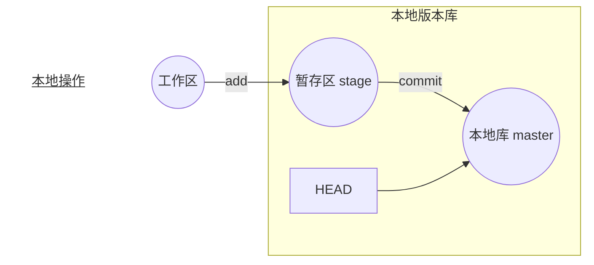
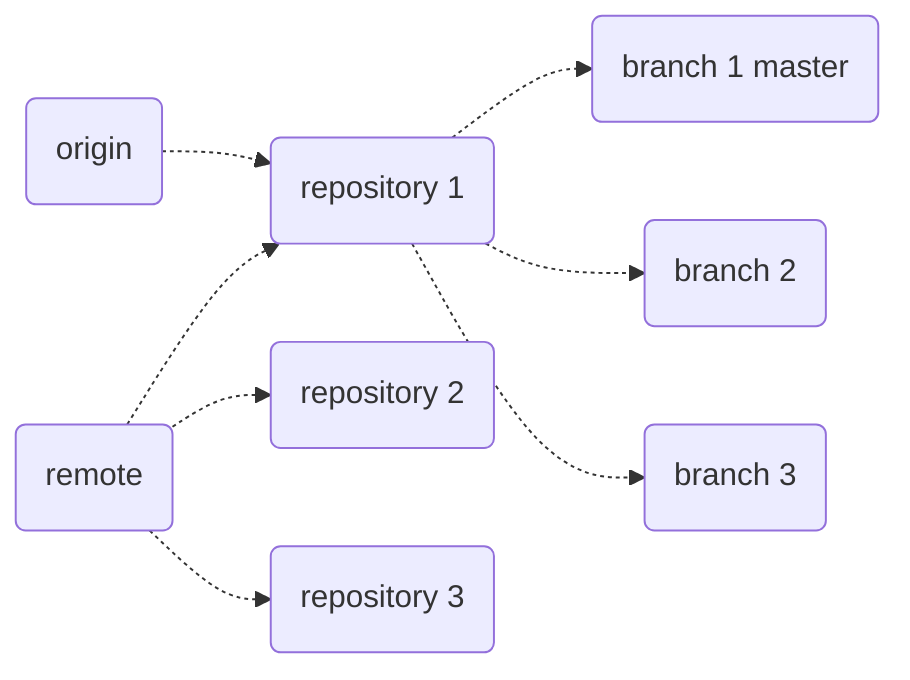
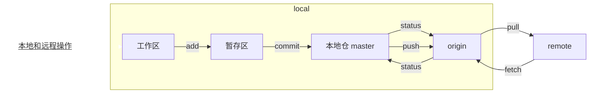
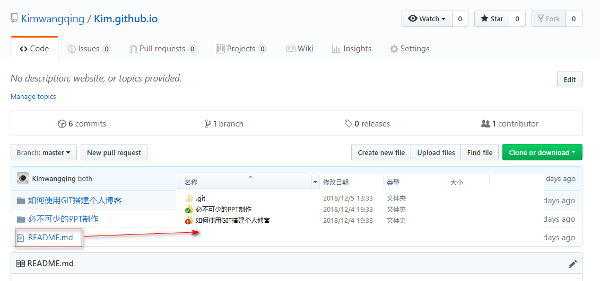

## Git 的使用
### Git 的准备工作
1. 下载安装 Git.

2. 进入 <https://github.com/> 注册账号。

3. 登录 Github 账户。

### 远程仓库及 Git 的配置
1. 新建一个版本库，又名仓库（远程库 repository，之后远程库的名字就是 origin，这是 Git 默认的叫法）。
**仓库命名格式：“你的名字.github.io”。**

2. 配置 SSH Key：
   第一次安装或重装系统后要用 `ssh-keygen -t rsa -C "邮件地址@youremail.com` 命令生成新的SSH Key。

 a. 获取 SSH Key 有两种方式：
 
 * 在本地仓库所在的文件目录右键 --> Git GUI Here --> Help --> Show SSH Key；
 * 在 C:\Users 里找到 id_rsa.pub 文件，里面既是 SSH Key。
	
 b. 添加 SSH Key：Settings --> SSH and GPG keys --> Add SSH Key，title 中输入密钥名称，key 中输入 id_rsa.pub 文件里的内容。
    *id_rsa 文件是私有密钥，id_rsa.pub 是公开密钥。*
    
 c. 测试
    可以输入下面的命令，看看设置是否成功，git@github.com的部分不要修改：
    `ssh -T git@github.com`
> The authenticity of host 'github.com (207.97.227.239)' can't be established.
RSA key fingerprint is 16:27:ac:a5:76:28:2d:36:63:1b:56:4d:eb:df:a6:48.
Are you sure you want to continue connecting (yes/no)?  # 直接输入yes
Hi cnfeat! You've successfully authenticated, but GitHub does not provide shell access.
    
3. 用户配置：
   Git是分布式版本控制系统，所以需要填写用户名和邮箱作为一个标识，使用 Bash 命令完成。如下图所示：      

   
   如果想查看用户和邮箱，使用 Bash 命令完成。如下图所示：   

    
** 以上 1、2 步骤无先后顺序。**

### 创建一个本地仓库：
找一个目录作为本地的仓库，比如我要对 D:\myBlog\Kim.github.io 里的项目进行管理，那么就在 Kim.github.io 下初始化仓库。

初始化仓库有两种方式：

* 通过 Git 的图形化界面来创建；
  在 Kim.github.io 的目录下右键选择 Git GUI Here –> 选择 Create New Repository。      
* 通过 Bash 命令完成。如下图所示：    

      
 ** 创建本地仓库后，本地目录里多了一个 .git 文件，有时是隐藏状态。**

### 本地操作
#### 概念理解

* 工作区（Working Directory）：是编辑器所处的那个文件，在这里指的就是 Kim.github.io 这个文件夹。
* 本地版本库（Reposotory）：是 .git 文件，它是 Git 在本地的版本库 。版本库里存了很多东西，其中有称之为 stage（或者叫 index）的暂存区，还有 Git 自动创建的第一个分支 本地库master，以及指向 本地库master 的一个指针叫 HEAD。

文档写完之后就是往工作区增添了一个文件，然后使用 `git status` 查看状态，`git status` 是查看工作区和暂存区有没有未被提交到本地仓库的文件：
* 工作区有未向暂存区保存的文件显示红色，使用 `git add ./文件名` 保存；
* 暂存区有未向 本地仓库master 分支提交的文件显示绿色，使用 `git commit -m "描述"/-a` 提交。

提交的时候一般常用两种方式：
* `git commit -a`
  这种方式提交时，不需要执行 `git add` 操作，自动就把所有修改的文件提交了。
* `git commit -m "描述"`
  这种方式只会提交之前保存的文件，所以想提交那些文件，先执行保存，之后，再 `git commit -m "描述"`。
  
    **第二种方式，提交前可以做修改，切记不要直接运行 `git commit -a`，它会忽视之前做的修改而把所有东西都提交到仓库中去。**

    **“描述”的意思添加一个备注，可以随意写，也可以理解为版本改动记录，必须要有，不然会报错。**
    
    **可以一次提交多个文件，所以可以 add 多个文件。** 比如：
    `$ git add file1.txt`
    `$ git add file2.txt file3.txt`
    `$ git commit -m "add 3 files"`
    

#### 具体操作 
1. 先将写好的文档保至暂时区： 
 
 a. 查看文档状态，使用 `git status` 命令完成。如下图所示  

文件是红色，这是说明我们这个文件已经做了修改，但是还未保存到暂存区。

 b. 执行保存，使用 `git add ./文件名` 命令完成：
 
  * 保存所有文件，使用 `git add .` 命令。如下图所示:     

 **add 与点符之间有一个空格。** 

 * 保存单个文件，使用 `git add 文件名` 命令。如下图所示：

 *之后，可以再次使用 `git status` 查看状态。如下图所示：* 
 
 此时，之前红色的文件都变成绿色。
 
2. 将文档提交至本地仓库，执行提交，使用 `git commit -m "描述"/-a` 命令。如下图所示：

此为提交单个文件示例。
 * 使用 `git commit -m "描述"` 对应保存步骤，可以提交所有文件或单个文件，如果上一步使用 `git add .`，执行提交后，即可提交所有文件；
 * 使用 `git commit -m "描述"` 对应保存步骤，可以提交所有文件或单个文件，如果上一步使用 `git add 文件名`，执行提交后，即可提交单个文件；
 * 使用 `git commit -a`，这种方式提交的时，不需要执行 `git add ./文件名` 操作，自动就把所有修改的文件提交了。

**提交修改和提交新文件是一样的，都是先 add，再 commit 到本地仓库。**

### Git 操作
#### 概念理解

git的服务器端 (remote) 端包含多个 repository，每个 repository 可以理解为一个项目，而每个项目下有多个 branch。

origin 是远程库的名字，这是默认情况下的远端库的名字，可以在 .git/config 之中进行修改。但是origin 这个名字一看就知道是远程库，是指向某一个 repository 的指针。服务器端的 master（强调服务器端是因为本地端也有 master）就是指向某个 repository 的一个 branch 的指针。
一个项目的刚开始，在服务器端，建立一个 origin，就是本体，然后在本体基础上 clone 到本地，也可以分支。
clone 在本地的，叫 master，有种本地的本体的味道，因为本地的还可以根据 master 进行分支，或者被别人再 clone。

#### 具体操作
1. 本地库与远程库关联
在本地仓库下运行命令 `git remote add origin gitSSH地址`，命令意思：在本地仓库添加一个远程仓库，并将本地的 master 分支跟踪到远程分支。

 a. 获取 SSH 地址，如下图所示：
 
 
 b. 执行以上命令，如下图所示：
 
        
2. 推送
在本地仓库下运行命令：
`git push -u origin master` 命令。命令意思：将本地 master 分支跟踪到远程 origin master 分支，-u 意思是指定 origin master 分支为上游分支，如下图所示：

从现在起，只要本地作了提交，就可以通过命令：`git push origin master`。

### GitHub Pages 配置
Github Pages 设计的初衷是为托管在 GitHub 上的项目提供介绍页面，开发者们可以通过 GitHub Pages 为他们的每一个项目创建一个用于介绍该项目的静态网站，不过由于他的空间免费而且稳定，因此用它搭建一个个人博客网站是再好不过了。

1. 在仓库 Settings 里配置 GitHub Pages。如下图所示：
   

2. 保存配置后，会自动生成地址，通过址址即可访问自已的网页。如下图所示：
   
 
## 有可能遇到的问题

* 在使用 Git 对源代码进行 Push 到 GitHub 时，有可能会报错。如下图所示：
  
 
 * 原因：
   本地的代码和远程 repository 中的文件个数不一致，即远程 repository 中存在本地项目中不存在的文件。如下图所示：
   
   
 * 解决办法：
   将远程 repository 中的代码可以通过如下命令进行代码合并，注：pull = fetch + merge，使用命 `git pull --rebase origin master`，或者 强制提交代码，命令行的话加上 -f 参数，但不建议这样执行。
   **这一步操作前保证暂存区没有未提交的文件，之后关闭本地文件再行操作。**
   执行上面代码后可以看到本地代码库中多了 README.md 文件。如下图所示：
   

* GitHub 创建博客时报错 404 "There isn't a GitHub Pages site here"。如下图所示：
  
  
 * 原因：
   可能是 GitHub 主题没有确定的原因。
   
 * 解决方法：
   在 Setting 页面时，找到主题并指定某个主题即可。如下图所示：
   
   
* Jekyll
  Jekyll 是简单静态博客生成器。