##  视频来源

https://www.bilibili.com/video/BV1MK411u7SH/spm_id_from=333.788.recommend_more_video.0

* 懂一些需要哪些算法，安排对应的工程师搞定算法：搭建模型-对算法训练
* 数据源从哪里来
* 定义产品功能和边界

* 算法、算力、数据支撑人工智能
* 人工智能已发展70年代， 起步于 1950 年代（图灵测试）
* 1997 年以前靠算法的突破
* 2016 年以前靠数据、算力的突破

AI 三大学派（不是割裂的，相互有交叉）：
* 符号派 原理：数理逻辑 方法：逻辑推理 应用：知识图谱 产品：模仿医生看 CT，模仿律师看案件
* 连接派 原理： 源于仿生学 模拟脑结构 方法：利用神经网络 应用：机器翻译
* 行为派：原理：控制论 模拟人的行为 方法：感知 + 控制 应用： 机器人

AI 历史变革：
第一次高峰： 56 年 - 70年 增强算法原型 
第二次高峰：80 年 - 87 年 算力突破 支持复杂算法
第三次高峰： 93 年 - 至今 互联网 IOT 的发展为 AI 数据支撑

人工智能产品的广义定义：具体算法、算力、数据的产品。 算力是基础。
（实现需求高在哪里，创意在哪里）
场景化案例

* 案例1 淘宝 - 拍立淘
（淘宝：20 个类目， 上万个小类目）
| 系统实现 | 依据 | 算法 | 算法模块 |
| --- | --- | --- | --- |
| | 用户拍照 》 | 云端计算 》 | 智能推荐 |
| | 用户拍照 》 类目分类 》 特征提取（识别） 》 商品库索引 》 队列排序 》 反馈结果 |||
| | 用户拍照上传数据 》 类目分类数据 》 特征值数据（识别） 》 商品库索引数据 》 队列数据 》 反馈结果数据 | 机器视觉 滤波视觉 特征提取 ... | 类目预测 》主体检测(分辨主图/辅图) 》 图像特征提取(深度学习(主特征提取: CNN 卷机神经网络 辅特性:logo 之类细节物 共同提取) 》 索引(对应特征值) 》 排序 》 返回前端 》 前端展现给用户 |

用户反馈不准: 
找到卡的原因, 
比如: 
提取类目: 有面料类目 (小众类目) 比较卡，在该类目上进行产品扩展,找面料专家配合设计这方面产品；
或是图像特征提取不准: 是因为主图辐图滤波算法不准或是别的原因不能提取，找到对应算法工程师，才能解决对应问题
找不到对应人会影响产品经理专业度、 信誉值
**产品经理应积极建立信誉值: 从运营部(用户需求)能精准找到部门或属于哪个模块找对应部门**
比如拍立淘用户反应速度慢: 有可能是检索慢,检索语句不健康或表结构设计不合理(数据结构或使用的函数不理想)

* 案例2 美团点评 美食智能推荐
场景: 某一天某个美团点评 5 年的用户, 某天该用户准备选餐厅时, 收到美团点评的智能推荐
实现逻辑::
| 用户输入文本、图片 》 | 数据(编号:逻辑管理 不断迭代 》 | 算法 》 | 智能推荐 |
| --- | --- | --- | --- |
|  | 用户 5 年的评论数据:评论编号, 用户编号, 评论数, 口味评分, 环境评分, 服务评分 | 文本情感相应算法(自然语言处理的一种或子任务), 机器学习(这些数据都属于深度学习), 神经网络 | |
| | | 算力是基础( 小数据量不明显, 大数据量 ( 多少个 T ) 均需要强大的算力  | |

例如：个性推荐、精准营销要懂协同算法、数据分析逻辑
擅长资源，比如擅长场景 + 懂对应的算法 = 优化产品
技术平台框架: tansflow （人工智能入门级平台）
数据服务中心： google, AWS (亚马逊云) , 视觉：google 

应用层的公司（可以不懂技术）

## 应用 AI 公司的分类
* 基础层
基础架构：芯片、云计算、框架等
arm 基础平台（几乎所有芯片的底层架构） tansflow（人工智能入门级基础平台）英伟达（人工智能芯片，机器视觉）
* 技术层
图像识别、语音识别、文本识别等
* 应用层
+AI: 智能医疗、智能安防等

### 深层分类
* 基础层：算力 + 数据存储服务（数据中心）
数据中心服务：对数据进行存储提供的服务能力
云服务：弹性计算、存储服务、云通讯、网络互联网中间件
* 技术层：算法能力输出
	* 计算机视觉
	例如：机场安检识别（商汤：安检 》 拍摄 》 （商汤：图像处理）+ 数据库对比 》 返回结果（通过/不通过）
	利用滤波算法、切换算法、神经网络（NN）等深度学习算法
	* 语音识别及语义处理
	例如：智能电视、语音遥控 人发起语音 》 语音识别 》 云知声（语义理解） 》 返回结果（本地检索）
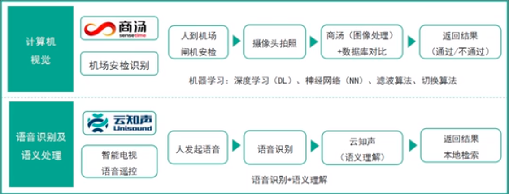
* 应用层：具体应用，场景问题解决

## AI 产品经理的工作职责和能力模型
### 不同类型 AI 公司的 AI 产品经理工作职责
* AI 型产品经理：偏向技术型：算法，代码，架构等基础层技术
* AI + 
	* to B: 行业赋能：探索型的（这类的产品理更值钱），比如语音识别的降噪需求
	* to C: 应用型：为行业做标杆，使底层算法更好赋能整个行业，比如科大讯飞（语音识别很强，但要做小蛋机器人，就是想树立行业标杆）
* +AI（产品经理对技术要求不高， 这类公司一般基于第三方算法公司）
	* 软件：对现有的基础上挖掘应用场景、技术选型：供应商选择及算法（懂一点算法开发），例如，以金融场景基础上加入机器人理财，丰富产品，成为产品亮点。再例如，可以将线下的业务抽取到线上，减少柜面压力，找第三方技术团队，但要懂一点 AI 和开发	
	* 软硬结合：外观设计和工程结构不一样，工程结构包括电路、电线布局等 》硬件要懂点 PCB ，确定 PCB 是否是自行画还是外包团队有能力画 》洽谈工厂：开手板模，正式模（感觉这个比较适合自已，但要知道软硬件开发流程，下图中，上行为软件开发流程，下行为硬件开发流程）》兼容测试（是否兼容硬件）		  
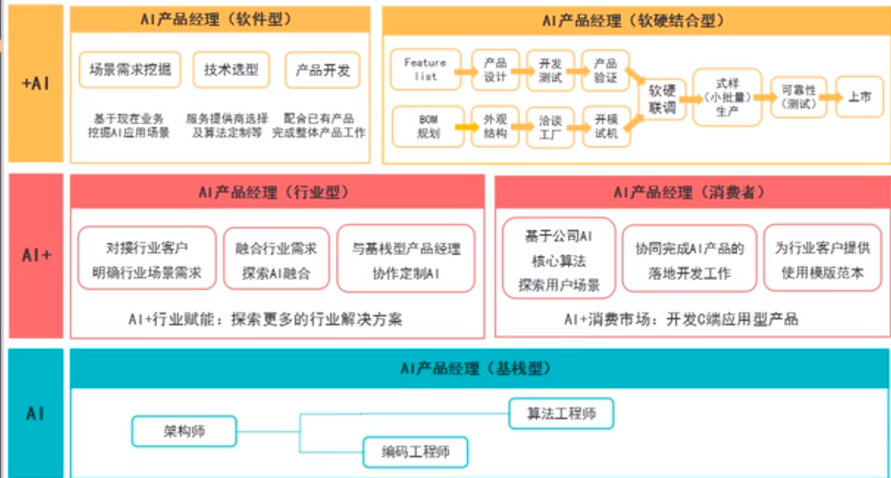

### AI 产品经理的能力模型
* 基栈型：数据采集，挖掘，管理数据型产品，懂算法
* AI +: 懂行业（要有行业背景），探索能力，精通产品打造流程
* + AI: 软硬结合最像产品经理，是未来的趋势，复合型能力
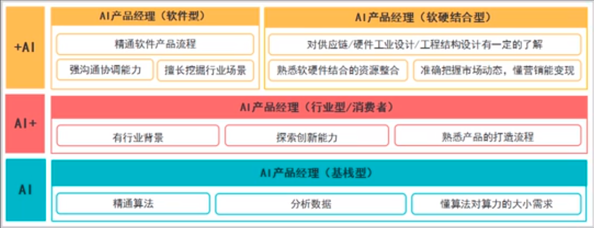

### 如何快速成为行业专家
下图为德勤如何在 2 周内成为行业专家
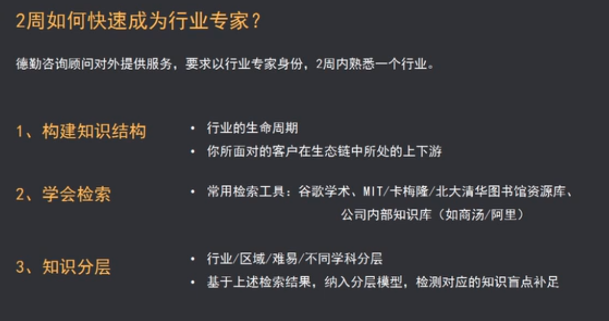

### 如何成为 AI 产品经理
真实了解自已，利用熟人资源
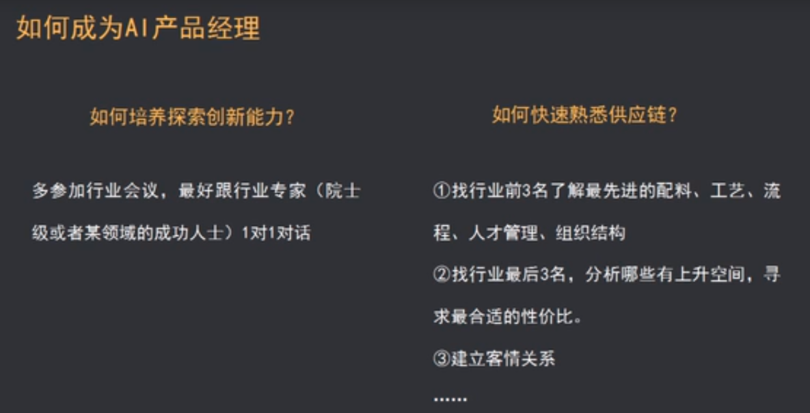

## AI 经理要不要懂技术
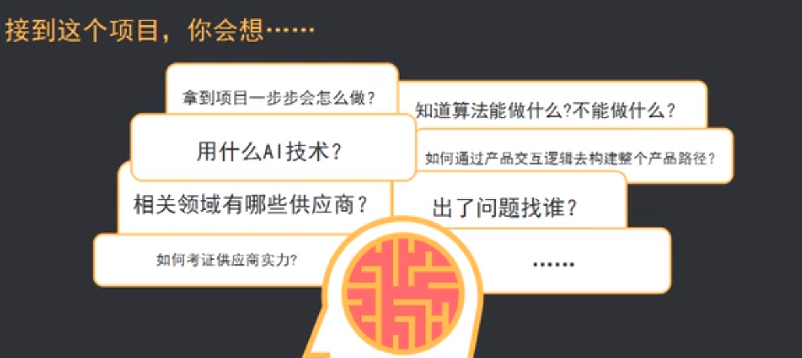
### 懂产品方案，包含
* AI 算法
 懂对应算法：做什么产品懂什么算法
* 数据
 知道数据来源，懂数据流程：数据来源 》清洗 》挖掘 》可视化
 AI 本身是以大数据为基础的
* 算力
 2080 显卡做普通产品，不理想，是浪费
* 硬件
 工业结构，BOM, 供应链
* 案例：军装照
|算法|数据|算力|
|--|--|--|
| 人脸识别 图片贴合 ...|H5 采集的数据 传感器数据 ...|并发 机器学|

 * 算法：
	* 人脸识别
    * 图片贴合: 知道哪些供应商愿意提供定制化产品
    * ...
  * 数据
	* H5 采集的数据：采集哪些数据
	* 传感器数据：使用什么摄像头，半智能的功能机能不能玩这样的算法
	* ...
	
  *  算力（不懂的话，会导致卡顿，云计算没有弹性
    * 并发：例如出现卡顿，原因：没想到用户群这么大 好在弹性云为并发提供很好的支撑
    * 机器学习：通过对算法、数据、算力的整合通过机器学习，使图片贴合更好地展现这款产品

### 不懂技术会导致的问题
* 没有数据采集的集中规划
数据采集、分析流程，同时在数据分析过程中，还需要算法来为数据模型进行求解，这时还需要知道需要用哪些数据分析的算法，比如，电商营销算法：协同过滤、关联规则推荐、机器学习，聚力等算法，并能说出具体用在哪一步上
* 无法写 AI 产品 PRD, 比如精准推荐：聚力，关联规则，标签（哪些是机器打的，哪些是人工打的）
* 沟通成本大，反馈对象搞错，比如语音识别，包含自然语言生成，自然语言理解，有的工程师只负责其中一个模块
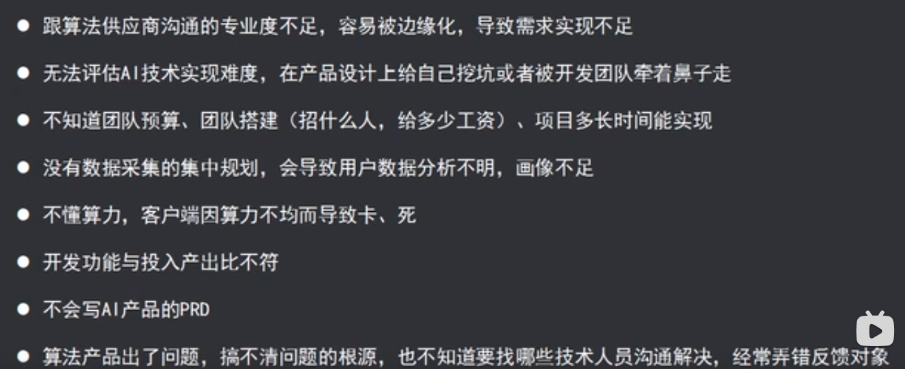

## AI 产品经理必须要懂的技术知识
AI 是以数据为基础，以算法为核心的技术，所以从数居和算法角度来讲， 懂**技术边界**
算法：功能，梯度，场景，行业
### AI 产品的数据流向
需求层：要有目标：泛 AI 产品都有一个核心目标 / 需要解决的问题（需求层）
数据层：数据获取 = 数据采集（采自已的数据还是别人的数据，需不需要爬虫）
分析层：对目标进行建模
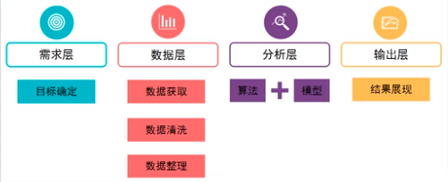

案例：美团外卖：实时智能调度
需求：订单 28 分钟以内送到客户手中
分析层：
建模（很大的特征工程）模型要考虑特征工程，比如区域特征，上海没有 3D, 深圳有 3D
算法：区分出餐高峰期和低峰期（利用机器学习实现在高峰期把消费者推荐给不需要排队的商家）
输出层：比如销售部新增站点，问产品经理站点是否合理，产品经理需要数据团队跑数据，模型团队建模，算法团队计算，得出站点是否合理的结论
然后，实现运力的规划（骑手是集中在陆家嘴还是别的地方），这是典型的运力规划
骑手的排班规划
配送点的路径规划（路径规划是典型的 AI 应用，在强人工智能：人机协同的时代会帮机器人规划路径）
配送范围（多远比较合理）：通过机器学习，深度学习计算出来的
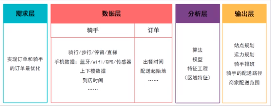

### 常用算法
蓝色部分为常用算法
NLG: 写诗
语音识别：通过语音识别技术完成交流或任务，语音模型识别，比如智能音响，智能窗帘
虚拟现实（VR）：提供新的娱乐方式
机器学习平台：transflow
针对 AI 优化的硬件和芯片：人脸识别摄像头：可以在终端处理，不用传到云端 AI 化进行比对，相当于迁移到硬件，优化摄像头实际是优化芯片
决策管理技术：帮四大会计所或华为大公司进行决策，供应链很多，分公司很多，AI 赋能的 ERP（进、销、存等），实现 x 24 小时 又可以 x 360 天的服务
深度学习：热门技术，是机器学习的一种代表
生物特征识别技术：比如家用指纹锁，红外摄像头
机器人流程自动化（IPA）：通过机器人流程自动化实现代替一部分劳动，比如可以代替出纳每天固定打开软件，输入固定的密码
自然语言处理（NLP）：不是很成熟的算法，比如，同样的话代表不同的意思，NLP 处理有门槛
知识图谱：淘宝小秘机器人，算法核心是知识图谱，对以前储备的问题进行数据库化，进行数字化，进行集成管理，生成后，遇到类似的问题可以推荐类似解答的方法
机器学习（**做为产品经理一定要知道**）：上面的很多算法都可以称为机器学习，但典型代表是深度学习
算法区分维度：
* 有监督 / 无监督
机器学习：是属于有监督学习
深度学习：半监督学习
强化学习：无监督学习（自我迭代升级）
* 算法相似度
NLG 典型属于 NLP
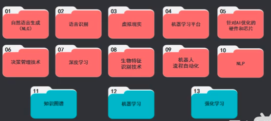

### 常用的 AI 算法解析
* NLG: 比如
  输入上联，输出下联
  输入麦当娜，输出歌星
  输入各种信息，输出年报
  输入新闻源，经过语义分析，语法，输出即时新闻
  边界：创作写作

* 语音识别

  严重依赖模式匹配的一种算法，以及依赖麦克风 / 扬声器，如果麦克风符合生物学原理，采集的会更好

  可以借助第三方的模型，如果是方言，还要第三方配合单独训练方言说关键词

  对着语音识别的模型  》 模型会特征提取 》模式匹配 》
                                                         》 模型库 》 模型匹配   

  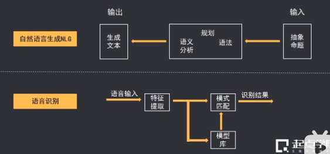

 		

