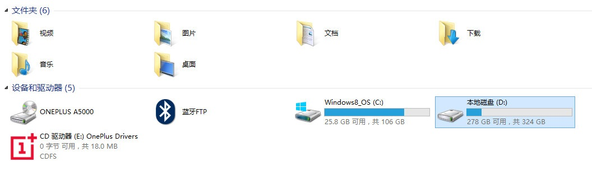
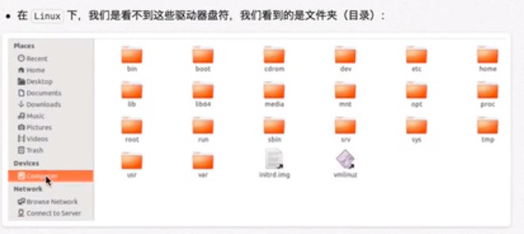
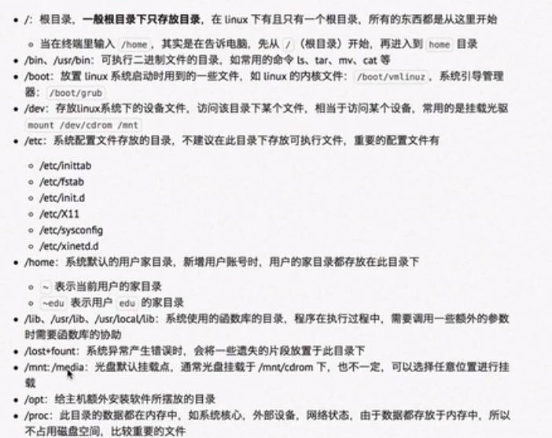
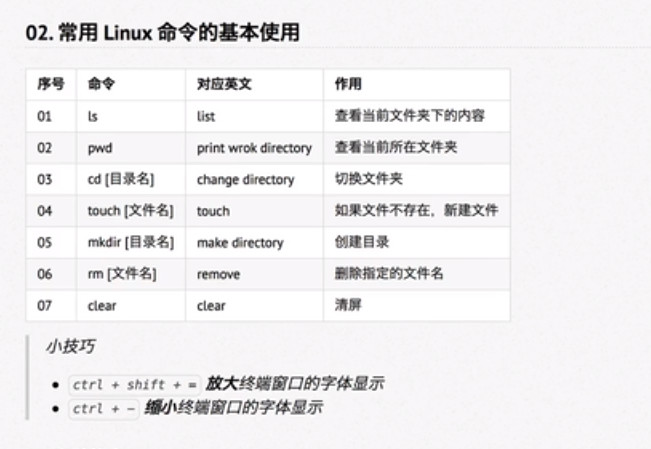
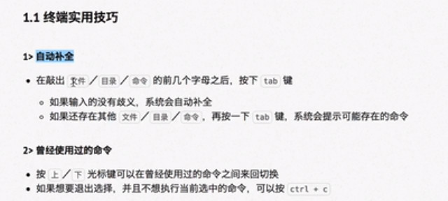
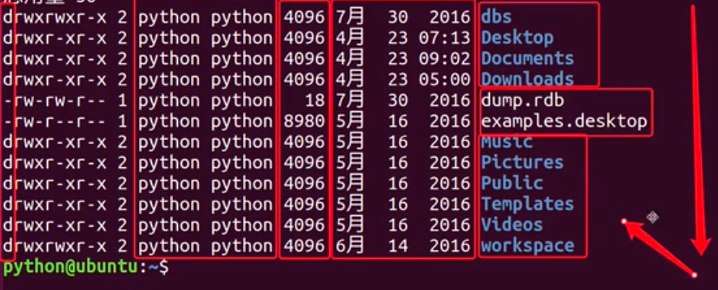

## 什么是操作系统
OS(Operation System): 

* 对硬件进行操作和管理
* 对硬件的操作封装成系统调用，方便其它应用程序通过对系统调用间接操作硬件

### 主流操作系统种类
针对应用方向不同：
* 桌面操作系统
* 服务器操作系统
* 嵌入式操作系统
* 移动设备操作系统

#### 桌面操作系统
* Windows系统：用户量大，应用软件多
* macOS：开发员使用
* Linux：用户量少，适用于服务器和嵌入式操作系统

#### 服务器操作系统
* Linux（大多数高级语言开发服务器使用的）
	* 安全、稳定、免费
	* 占有率高
* Windows Server （微软）(.net开发的服务器软件)
	* 付费
	* 占有率低  
** Python 开发 web 服务器时，选服务器时用linux **

#### 嵌入式操作系统(智能硬件)
* Linux（内核小，开源，开发商自行定制， AI开发领域必不可少）
* Python 可以在linux上可以自由开发

#### 移动设备操作系统
* iOS
* Android (基于linux )

## Linux 内核及发行版本
### Linux 内核版本
* 内核（Kernel）：管理硬件的核心程序
	* 系统调用 
	* 终端命令：检测系统调用是否正确，同时，方便对硬件操作，将系统调用包装成终端命令，由终端命令调用系统调用，间接操作硬件设备

### Linux 发行版本
在Linux内核版本基本上搭建一套应用程序，包括：桌面系统，基本图形界面程序，游戏...，打包成的发行版本，直接通过Linux内核提供系统调用间接访问硬件。如Ubuntu、Redhat (红帽子）、Fedora、Debian...
**底层内核只有一个**
发行版本通常包装桌面环境，办公套件，媒体播放器这些应用程序
Ubuntu是十大发行版本最受欢迎。

## Windows 和 Linux 文件系统区别
* Windows 是单用户操作系统，指一台计算机在同一时间只能有一个用户使用，一个用户享用系统的硬件和资源。
* Linux 是多用户操作系统，指同一台计算机在同一时间可以有多个用户使用，多个用户共同享用系统的硬件和软件系统。

### Windows 下的文件结构
 
* 有盘符概念

### Linux 下的文件结构

* 没有盘符的概念，只有一个盘，这个盘就是根目录（有/来表示）。
* 为了保证多用户之间有冲突，Linux 有个home目录（家目录），可以在其下面随意增减文件夹。

## Linux 主要目录速查表

**cd 后面有一个空格**

## Linux 命令的基本使用

### 终端命令格式
* command [-options] [parameter]
  例如：`rm r 文件夹名`
*  command --固定选项

### 查阅命令 
* command --help
* man help
	*  空格键 显示下一屏
	*  Enter 显示下一行
	*  b 回滚上一屏
	*  f 后滚一屏
	*  q 退出

### 终端实用技巧

### ls 命令说明
* `.`  开头的文件为隐藏文件
* `-a` 查看所有文件，包括隐藏文件）： `ls -a`
* 用 `rm` 执行删除文件时，也需要将 `.` 加上
* `.`-当前目录
* `..` 上一级目录
* `ls` 是以水平方向列出文件夹包含的文件
* `ls -l` 是以列表方式列出文件夹包含的文件（包括创建日期和大小）  
  
	第一列字母含义
  
  	* d: 表示对应的是文件夹
  
    * -: 表示对应的是文件
  
* `ls -l -h` 是以人性化方式列出文件夹包含的文件（包含文件大小， 创建时间，末次修改时间）	
	
	* `ls -l` 和 `ls -l -h` 只是显示文件大小有区别，`ls -l -h` 更直观	
* `-a`, `-l`, `-h` 可以分开输入或合在一起输入，没有先后顺序	
	* `ls -lh` = `ls -l -h`
	* `ls -lha` = 显示当前所有文件（包括隐藏文件）
	** 隐藏文件是配置文件，不必理会。**

### 通配符的使用
* `*`代表任意数个字符
* `?`代表任意一个字符 (必须是一个字符)
* `[]` 代表匹配的字符组, 提取的结果包含在中括号内的字符

### 切换目录
* 回到家目录:
	* cd 回车
	* cd ~	
* cd ~ / xxx 切换到家目录下面的目录
* cd - 最近两次工作目录来回切换
* cd . 保持当前目录不变

### 创建和删除操作
#### mkdir
* -p 递归创建目录（不用一层层进入后创建）。
  例如： mdkir -p a/b/c
  也可以用 cd a/b/c 递归切换
  
#### touch
* 如果文件不存在，直接创建文件
* 如果文件存在，直接修改末次修改时间
* 可以递归新建：touch a/b/c/123.txt，直接在 c 目录下创建 123.txt 文件

#### rm
* **使用 rm 会从磁盘中彻底删除，并不是存放在垃圾箱中，更加不能使用 rm * **
* rm 只能删除文件，且删除文件时，需要加上后缀
* rm -r 可以删除文件和文件夹
* 选项：
	*  -f 强制删除，文件如果存在，直接删除，如果不存在也不会提示
	*  -r 可以删除文件夹，无论该文件夹里包含多少个文件或文件夹，都会被一次删除
* rm 也可以使用通配符 

### 拷贝和移动文件
#### tree
* tree 命令可以在终端中以树状图的形式列出文件的目录结构
* tree ~ 根目录下的树型结构
* tree 或 tree . 当前目录下的树型结构
* 选项：
	* tree -d 只会显示目录，不显示文件

#### cp 复制或覆盖
* 格式：cp 源文件路径 目标文件路径 
* 文件或目录在当前目录：
	* 文件或目录直接输入文件或目录名，不用路径
* 文件或目录在当前目录下的路径：
	* 文件或目录需要加路径，从子目录开始，例如：cp a/b/c/c.txt . （当前目录：Desktop, 指在当前 Desktop 目录下 a 目录下的 b 目录下的 c 目录 下的 c.txt 文件复制到当前 Desktop 目录）  		
* 文件或目录不在当前目录需要加路径，要么当前或根目录开始：
		* 当前目录：./
		* 根目录：~/
* 例如：
  cp ~/Documents/1234.txt ~/Desktop/1234.txt 
  或 cp ~/Documents/1234.txt . （直接输入目标文件路径即可） 
  或 cp ~/Documents/1234.txt a.txt （直接输入目标文件名称--换名复制，即在当前目录下复制）
* 复制文件或目录，相当于 windows 的 copy
* 选项：
  * cp -i 显示是否覆盖的提示 -- 为了安全起见，建议使用 （如果没有 -i 选项，直接覆盖没有提示）
  * cp -r 复制目录 （源目录下的文件一并被复制）
  * cp -r -i 显示是否覆盖提示

#### mv 移动文件/目录或重命名
* 格式：mv 源文件 目标文件
* 路径书写同 cp
* 移动：不用指定目标文件或目录
* 重命名：指定目标文件或目录，如目标文件或目录不存在，就是移动；如果目标和文件存在，就是重命名
* 选项：
	* mv -i 显示是否覆盖的提示 -- 为了安全起见，建议使用 （如果没有 -i 选项，直接覆盖没有提示）