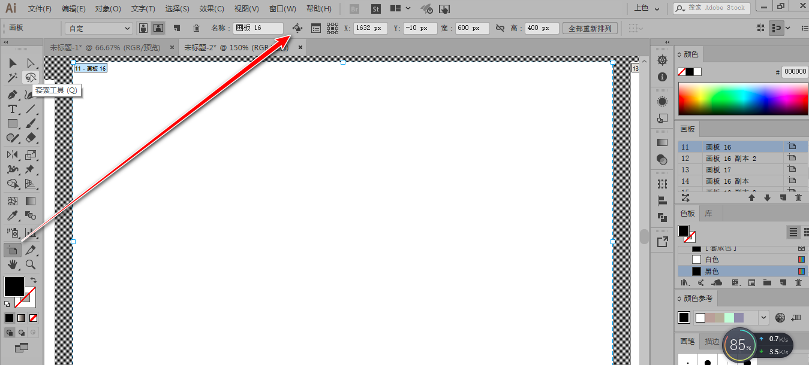
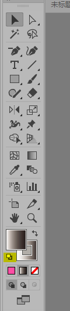
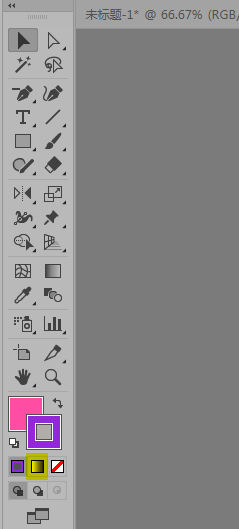
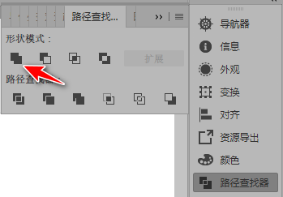
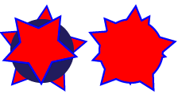
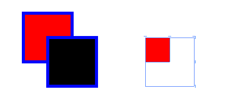
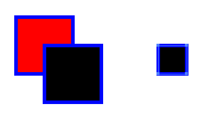
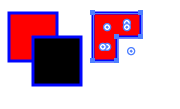
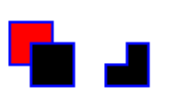

## 快捷键
**“编辑” 下方的 “键盘快捷键” 进行编辑快捷方式 
**快捷键要在英文模式下才能实现**
* 标尺: ctrl + r
* 画布大小: ctrl + +或 -, ctrl + 1 恢复 100% 显示
* 首选项: ctrl + k
* 选择右上角"传统基本功能"
* 颜色面板可以拖动, 按右上角 上色 > 重置上色 可以恢复
* 左侧工具栏关闭后恢复: 
	* 或窗口 > 工具里点击默认
* 首选项 > 性能 > 勾选 GPU，可以使用画面感好一些，不勾选可以提高运行速度 
* 缩放状态下 (放大镜)， 按住 alt 切换成缩小状态 (减号)，滚动鼠标缩放画布
	* 等同于: ctrl + +或 -
	* 或 alt + 滚动鼠标
* 画板快捷：
	* 移动画板: 空格键 + 鼠标左键
		* 空格键 + 鼠标滚动 = 画板上下移动
		* ctrl + 空格键 + 滚动鼠标 = 画板左右移动 或 ctrl + 滚动鼠标	
    * 选中画板：shift + 大写 O 
    * 缩小放大：alt + 鼠标滚动
    * 最大化显示画板：
    	* 选中画板最大化显示：ctrl + 0（数字零）
    	* 所有画板最大化显示：ctrl + alt + 0（数字零）	
* Tab 键： 左工具栏和右属性栏消失， Shift + Tab 键： 右属性栏消失
* 两次 F 键： 上下左右栏全部消失， 可以类似展示 PPT 一样滚动鼠标上下演示
	* 等同于左侧工具栏下方“更改屏幕模式”，全屏模式
* ctrl + Y 轮廓 / 视图模式切换, 视图模式下无法着色
* 大写 V 选择工具 (选中图形)
* 大写 A 直接选择工具 (选中图形路径, 单个路径是要在单个范围附近划出虚线框,不然会对所有路径统一改变)
* X 是描边和填充的先后切换

## 基本概念
### 矢量图的优缺点
* 矢量图的优点
	* 体积小
	* 无限制缩放
	* 可以输出最高分辨率印刷
* 矢量图的缺点:
	* 很难表现色彩层次逼真效果的图像 (但位图可以)

### 矢量图导出
* 大部分位图是由矢量图导出的
* 矢量图是位图之母
* 导出格式:
	* JPG (有损压缩格式) : JPEG 选项中品质可选
	* PNG (带有透明通道格式) :
		* 分辨率可选 ,300ppi为打印时可选
		* 消除锯齿: 文字和图像
	* TGA (带有透明通道格式) :用于视频流
	* TIFF: Photoshop经常可用到, 用于保存图层和通道信息
	* 1 倍图, 2 位图...导出 将图片拖动至"资源导出", 左下方缩放:1x, 2x...对应 1 倍图,2 倍图, 格式里 JPG 100, JPG 80 ...100 对应的品质最高

### 图片处理
#### 置入（可导入多张图片）
* 单击置入：等比例置入图片 	
* 置入时拖动鼠标，会按照拖动的大小等比例显示
* 拖动置入：鼠标拖拽图片至此即可
* 嵌入（置入图片时上方会出现嵌入）：此时图片只是链接，再次打开时会消失不见，单击嵌入可以使用图片完全导入，不会以链接形式存在

#### 复制 
* ctrl + v
* alt + 鼠标左键拖动

#### 删除
* Delete 键
* 退格键

#### 勾勒出图片路径
* 视图 > 轮廓 或 ctrl + y

### 画板原理
#### 新建多个画板
* 方法一：新建 > （预设详细信息）选择画板数量 > 更多设置里选择画板排列方向 （Z 型， 倒 N 型， 一型，竖型）
* 方法二：Shift + O 选中画板，选中箭头变成十字型，直接 alt + 拖动鼠标 复制画板

#### 复制画板
* 方法一：在选中画板的状态下，alt + 鼠标左键盘 拖拽画板即可复制
* 方法二：窗口 > 画板 画板窗口点击新建即可复制，此窗口可以上下拖动画板，调整画板顺序
* 点击 “画板工具” （左侧工具栏内） ， 激活画板工具栏状态 （显示在上方），点击上方  ”移动 / 复制带画板的图稿“ 按钮，此时复制会将画板上所有的图片一起复制；再次点击此按钮只会复制画板 
 {:height="50%" width="50%"}

#### 复制矢量图
* 同一个文档复制： 选中图标 > alt + 鼠标左键盘
* 跨文档复制：上方状态栏 > 排列文档 > 垂直排列 > 复制

### 自定义预设界面
* 拖动右侧的属性栏，比如图层，拖出来，再拖到右侧栏，侧边形成高亮后，使用图层单独形成一栏
* 或拖动到右侧属性栏下方，下面形成高亮后，图层在右下方单独形成一块
* 属性栏添加完成后，可以通过点击上方选择 "新建工作区" 保存设置个人预设，点击 "基本功能" 回来基础设置

### 基本形状和属性
* 基本形状是复杂图形的基础
* 正多边形 圆形: shift + alt = 中心点绘制
* 正多边形 星形 
    (以下操作都是在创建(鼠标箭头呈十字状态:)时操作, 鼠标左键不松开)
	* shift + 鼠标不松手 + 上 /  下箭头 = 上: 边数增加 下: 边数减少 通过此法绘制正三角形, 
	* ctrl + 拖拽鼠标 拉长角
	* 星形: ctrl + alt 时恢复五角星样子  
* 轮廓模式
  视图 >  轮廓 该模下可以看到所有路径,包括隐藏路径(轮廓颜色设定无时)
  
### 图形上色技巧
* 除了左侧栏上色,细致上色通过右侧属性栏,单击 "描边" 字样
* 窗口 > 颜色 下方的色板 鼠标呈吸管状,直接点击更改颜色 (配合 X 转换描边或填充颜色)
* shift + X 描边色和填充色替换
* 左侧填充和描边左下方有个小黑白描边和填充图标, 是默认黑白描边和填充色图标,用 D 快捷切换
 {:height="20%" width="20%"}
* 渐变描边和填充色图标在实体着色图标旁边、
 {:height="20%" width="20%"}
* / 为禁止着色快捷键 (配合 X 转换描边或填充颜色), 使用之后只剩下路径
* I (大写i) 吸管工具快捷键, 同时按住鼠标左键不松手: 可以填充吸超出界面以外的任一颜色；同时按住鼠标左键不松手 + shift :  可以描边吸超出界面以外的任一颜色

### 图形自由变换属性
大写 V 选中图形 > 变换：图形移动，缩放，旋转等
* shift + 按住图形 = 等比例缩放， alt + shift + 按住图形 = 以图形中心为原点进行等比例缩放
* shift + 旋转角度 = 45度旋转（等比例旋转），右侧属性里角度数值改为0， 角度还原成水平
* 再次变换：重复上一次操作（ctrl + d） 结合alt + 拖拽图形：形成变换路径 后可以叠加画出重复上一次路径的图形
* 移动、旋转（可以做成雪花对称图形）：需结合重复上一次操作（ctrl + d） 操作
* 缩放 > 属性： 比例缩放描边和效果 = 描边会随之缩放一起缩放，
  缩放 > 属性： 缩放圆角 = 圆角会随之缩放一起等比例缩放
* 分别变换：是将上面的变换属性放在一起
	* 效果 > 扭曲和变换 > 变换 和上面的分别变换差不多，多了一个副本（可直接填入复制数量 = 不用ctrl + d）

### 图形变换 - 樱花绘画
* 先画五角形，配合上下键增减角数（十来个角即可）
* 调整渐变色，渐变色板 > HSB 里圈粉红色，外圈白色
* 再画一个多边形（此时自动复制上一个调整好的多边形样式，包括颜色）
* 按住 波浪形 ~ 不放，画倒 S 型即可

### 图形合成 - 布尔运算
* 窗口 > 路径查找器
* alt + 联集：复合形状保留原形状的路径（不合并路径），可以对原形状及路径锚点编辑

* 退出复合：A (直接选择工具) > ctrl + x 剪切其中一个图形 > 空白处 ctrl + v 复制刚才剪切的图形 > 再全部选中 > 再点击扩展 此时退出复合模式
* 全选 > 联集 > 扩展：在确定编辑好后，合并路径
* alt + 减去顶层：效果：两个黑色圆形叠加，alt + 减去顶层可以得到类似眼睛的效果

### 图形合成 - 路径查找器
* 分割功能比较常用
* 路径查找器下的状态操作后都处于编组的状态
* 在非复合模式下 > 选中两个叠加图形 > 分割 > 右键取消编组 > 此时叠加图形已被分割

* 在非复合模式下 > 选中两个叠加图形 > 修边 > 去除两个图形边线，此时再分割（与上不同）按照去除边线后进行分割（沿工作路径分割）

* 合并有三个功能：
	* 相同的颜色连片
	* 不同的颜色保留
	* 描边去掉

* 联集与合并的区别：
	* 相同的颜色连片
	* 不同的颜色不保留
	* 描边保留

* 裁剪与交集的区别：
	* 裁剪去除描边，颜色保留叠加层下层颜色
			
	* 交集保留描边，颜色保留叠加层上层颜色

* 轮廓与视图里的轮廓的区别：
	* 轮廓是针对单独和图形，自带分割（取消编组后）
	* 视图里的轮廓是针对全局轮廓
* 减去后方对象与减去顶层的区别：
	* 减去顶层：去除重叠图形的上层及重叠部分

	* 减去后方对象：去除重叠图形的下层及重叠部分

